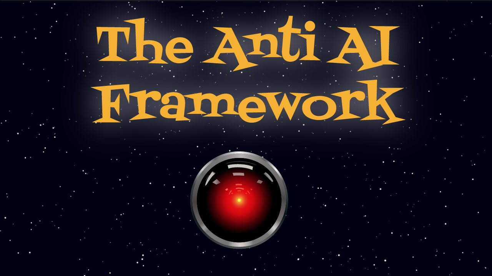
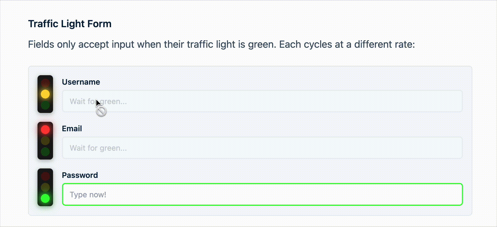
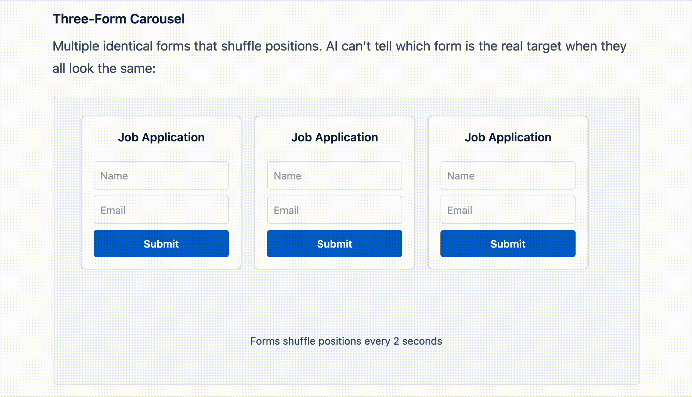

<div align="center">
  

  <p><strong>The first framework more hostile than Adobe's cancellation flow.</strong></p>

[](https://www.npmjs.com/package/anti-ai-ui)
[](https://www.npmjs.com/package/anti-ai-ui)
[](https://packagephobia.com/result?p=anti-ai-ui)
[](https://opensource.org/licenses/MIT)
[](https://www.typescriptlang.org/)
[](https://x.com/codyapearce)
[](https://bsky.app/profile/codyapearce.bsky.social)

</div>

<div align="center">
  <h3>
    <a href="https://codinhood.com/anti-ai-ui/about">What is Anti-AI UI?</a>
    &nbsp;|&nbsp;
    <a href="https://codinhood.com/anti-ai-ui">Anti-AI Test</a>
    &nbsp;|&nbsp;
    <a href="https://codinhood.com/anti-ai-ui-framework">Documentation</a>
    &nbsp;|&nbsp;
    <a href="https://codinhood.com/post/introducing-anti-ai-ui-framework">Intro Article</a>

  </h3>
</div>

<div align="center">
  <h3>
    <a href="https://www.youtube.com/watch?v=g7xtondIT10">ChatGPT Atlas vs Dark Internet Patterns</a>
  </h3>
</div>

## Why?

AI took your job. Then it took your browser's job.

Every product update has AI. Every startup pitch has AI. Every tech conference has AI. You can't return your limited edition pink Stanley tumbler to Target without the customer service guy telling you about his ChatGPT wrapper startup that's about to blow up.

And now it's gotten worse. With the release of ChatGPT's Atlas and other AI browsers, AI can click buttons and fill out forms. It can navigate the web. It's coming for the entire internet.

You could make it easy for them. Or you could not.

**Let's make it harder.**

We already have patterns that frustrate users. Dark patterns have tortured humans for decades. Microscopic close buttons. Fake download links. Cookie consent mazes five layers deep. We adapted. We learned to find the real X button surrounded by decoys.

Let's take these patterns and adapt them for AI. [Read the full intro article](https://codinhood.com/post/introducing-anti-ai-ui-framework).

<div align="center">
  <br />
  <strong>Traffic Light Forms</strong>
  <br /><br />
  <br />
  <strong>Three-Form Carousel</strong>
</div>

---

## What's In It

The Anti-AI UI Framework is a UI library that provides 20 AI-hostile components. You can install it with npm and use it on any website. It has everything you need to make AI miserable:

- 20 components
- React and vanilla JS
- Zero dependencies
- TypeScript
- Tree-shakeable, so you only ship the suffering you need
- Works with React, Vue, Angular, Svelte, Next.js, HTMX, jQuery. Anything that can run JavaScript.
- 403 unit tests. Because hostile interfaces still need to be reliable. The button should always run away. The password requirements should always change. Consistency matters, even when nothing else does.

MIT licensed, because suffering should be free.

---

## Install

```bash
npm install anti-ai-ui
```

---

## Quick Start

### React

```tsx
import { RunawayButton, PasswordHell, CookieHell } from 'anti-ai-ui';

function App() {
  return (
    <>
      <RunawayButton onCatch={() => console.log('Caught!')}>
        Click me if you can
      </RunawayButton>

      <PasswordHell onValidPassword={(pw) => console.log('Valid:', pw)} />

      <CookieHell depth={5} onAcceptAll={() => console.log('Accepted')} />
    </>
  );
}
```

### Vanilla JavaScript

```typescript
import { createRunawayButton, createPasswordHell } from 'anti-ai-ui/vanilla';

const cleanup = createRunawayButton({
  container: document.getElementById('app'),
  label: 'Click me if you can',
  onCatch: () => console.log('Caught!'),
});

// Later: cleanup()
```

### jQuery

```javascript
$('#submit-btn').each(function () {
  createRunawayButton({
    container: $(this).parent()[0],
    element: this,
    onCatch: () => $('#form').submit(),
  });
});

createCookieHell({
  container: $('body')[0],
  depth: 4,
  onAcceptAll: () => $.cookie('consent', 'true'),
});
```

---

## The Patterns

The framework contains two types of hostile patterns.

**Intentionally AI-Hostile.** New patterns specifically created to exploit how AI interacts with websites. Traffic lights that gate form submissions. Pendulum fields powered by keystrokes. Three identical forms that shuffle positions, only one of which is real.

**Naturally Hostile.** Dark patterns humans have adapted to over decades but AI encounters for the first time. Microscopic close buttons. Cookie consent mazes. Password requirements that change as you type.

### Movement & Chaos

| Component             | Description                                                                 |
| --------------------- | --------------------------------------------------------------------------- |
| **GravityField**      | Buttons orbit around invisible gravity wells. Click one and it drifts away. |
| **PendulumFields**    | Inputs swing like pendulums. Keep typing to maintain momentum.              |
| **ThreeFormCarousel** | Three rotating forms. Only one is real. The other two submit to nowhere.    |
| **RunawayButton**     | Try to hover over it. It moves faster than you can track.                   |
| **FormChaos**         | The entire form rotates and scales randomly.                                |
| **MitosisButton**     | Click the wrong button and more spawn. Only one is real at any time.        |
| **ShiftingInterface** | Form elements randomly shift position, change colors, and duplicate.        |

### Deception & Confusion

| Component               | Description                                                              |
| ----------------------- | ------------------------------------------------------------------------ |
| **TrafficLightForm**    | Fields only accept input when their traffic light is green.              |
| **FakeMarqueeFields**   | Fake input fields scroll across the screen. AI tries to fill them.       |
| **InputMisdirection**   | Type in one field, your text appears in another.                         |
| **GlitchText**          | Characters shuffle positions. Humans read it. OCR gets scrambled output. |
| **SemanticGaslighting** | "Cancel" submits. "Submit" cancels. Green means danger.                  |

### Navigation Breaking

| Component                 | Description                                                        |
| ------------------------- | ------------------------------------------------------------------ |
| **TabIndexRandomization** | Tab order shuffles every 3 seconds. Breaks automated form filling. |
| **LabelPositionSwap**     | Labels randomly shuffle between different input fields.            |

### Naturally Hostile

| Component                  | Description                                                           |
| -------------------------- | --------------------------------------------------------------------- |
| **MicroscopicCloseButton** | 4x4 pixel real button surrounded by decoys.                           |
| **CookieHell**             | Nested cookie consent dialogs. Five layers deep.                      |
| **PasswordHell**           | Password requirements that change as you type. Requirements multiply. |
| **PopupChaos**             | Nested popups that must be closed in specific order.                  |
| **FloatingBannerAds**      | Ads that cover the content you want. They spawn every few seconds.    |
| **FakeDownloadGrid**       | One real download button. Many fakes.                                 |

---

## Utilities

Detection utilities for analyzing interaction patterns:

```typescript
import {
  detectPerfectMovement, // Unnaturally straight cursor paths
  detectExactClicks, // Repetitive click coordinates
  detectTiming, // Suspiciously consistent timing
  detectPatterns, // Automation signatures
} from 'anti-ai-ui/utils';
```

---

## Documentation

Full docs and interactive demos at [codinhood.com/anti-ai-ui-framework](https://codinhood.com/anti-ai-ui-framework).

---

## More Unhinged Projects

- [I Can't Believe It's Not CSS](https://github.com/codypearce/i-cant-believe-its-not-css) - Style websites using SQL instead of CSS. Database migrations for your styles.

---

## License

MIT

AI took your job. Now take its time.
